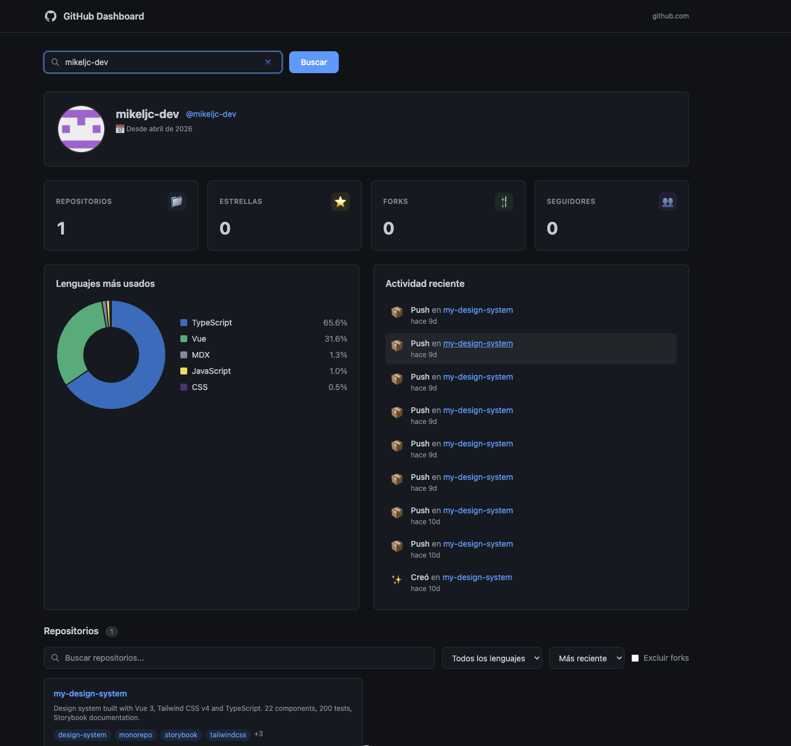

# GitHub Dashboard

> Visualiza el perfil, repositorios y actividad de cualquier usuario de GitHub en un dashboard moderno y accesible.

[](https://github.com/mikeljc-dev/github-dashboard/actions/workflows/ci.yml)
[](https://nuxt.com)
[](https://vuejs.org)
[](https://www.typescriptlang.org)
[](https://tailwindcss.com)
[](https://vitest.dev)
[](https://playwright.dev)

---

## Demo en vivo

🔗 **[github-dashboard-nqirascw7-mikeljc-devs-projects.vercel.app](https://github-dashboard-nqirascw7-mikeljc-devs-projects.vercel.app)**



---

## Características

- 🔍 **Búsqueda por URL** — `/?user=mikeljc-dev` hace el dashboard shareable y bookmarkable
- 📊 **Métricas del perfil** — repos públicos, estrellas acumuladas, forks y seguidores
- 🌐 **Gráfico de lenguajes** — top 6 lenguajes con Chart.js (doughnut)
- 📂 **Lista de repositorios** — búsqueda, filtros por lenguaje, ordenamiento, exclusión de forks
- 📅 **Actividad reciente** — últimos 10 eventos públicos con iconos por tipo
- ⚡ **Caché en dos capas** — HTTP `Cache-Control` en servidor + `sessionStorage` en cliente (TTL 5 min)
- ♿ **Accesible** — WCAG 2.1 AA, skip link, `aria-live`, `role="alert"`, navegación por teclado
- 🔒 **Seguro** — token nunca expuesto al cliente, proxy server-side, headers de seguridad

---

## Stack tecnológico

| Capa       | Tecnología                  | Por qué                                                   |
| ---------- | --------------------------- | --------------------------------------------------------- |
| Framework  | **Nuxt 4** (Vue 3)          | SSR nativo, server routes como proxy, file-based routing  |
| Lenguaje   | **TypeScript** (strict)     | Tipado estricto sin `any`, interfaces completas de la API |
| Estilos    | **Tailwind CSS v3**         | Utility-first, sin CSS muerto en producción               |
| Gráficas   | **Chart.js + vue-chartjs**  | Ligero, bien mantenido, `<ClientOnly>` para SSR           |
| Estado     | **Pinia**                   | Setup syntax, computed para datos derivados               |
| Utilidades | **VueUse**                  | `useDebounceFn` para búsqueda reactiva                    |
| Testing    | **Vitest + Playwright**     | Unit + E2E, cobertura > 70%                               |
| CI/CD      | **GitHub Actions + Vercel** | Deploy automático en merge a `main`                       |

---

## Arquitectura

### Proxy server-side (seguridad)

El token de GitHub **nunca llega al cliente**. Todas las llamadas pasan por server routes de Nuxt:

```
Browser → /api/github/user?username=X → Nuxt Server → api.github.com (con token)
```

El servidor añade `Authorization: Bearer <token>` y devuelve solo los datos necesarios.

### Caché en dos capas

```
Request → sessionStorage (TTL 5min) → HIT: respuesta inmediata
                                     → MISS: /api/github/* → Cache-Control → GitHub API
```

- **Server**: `Cache-Control: public, max-age=300` (repos/usuario) — CDN cachea entre usuarios
- **Client**: `sessionStorage` con TTL de 5 minutos — evita re-fetches al navegar

### Cancelación de requests

Cada búsqueda nueva crea un `AbortController` que cancela la anterior. Si el usuario escribe rápido, solo se procesa la última.

### Concurrencia limitada

`fetchLanguages` hace hasta 20 peticiones (una por repo). Implementado `pLimit` propio con máximo de **8 requests paralelos** para no saturar la API.

---

## Instalación y desarrollo local

### Prerequisitos

- Node.js >= 18
- npm >= 9
- Una cuenta de GitHub (para el token)

### 1. Clonar el repositorio

```bash
git clone https://github.com/mikeljc-dev/github-dashboard.git
cd github-dashboard
```

### 2. Instalar dependencias

```bash
npm install
```

### 3. Configurar variables de entorno

```bash
cp .env.example .env
```

Edita `.env` con tu token de GitHub:

```env
GITHUB_TOKEN=ghp_xxxxxxxxxxxxxxxxxxxx
```

#### Cómo obtener el token

1. Ve a **GitHub → Settings → Developer settings → Personal access tokens → Tokens (classic)**
2. Haz clic en **Generate new token (classic)**
3. Nombre: `github-dashboard`
4. Scope: marca solo **`read:user`**
5. Copia el token generado y pégalo en `.env`

> **Sin token**: el dashboard funciona con límite de 60 req/hora. Con token: 5.000 req/hora.

### 4. Iniciar el servidor de desarrollo

```bash
npm run dev
# → http://localhost:3000
```

---

## Scripts disponibles

```bash
npm run dev           # Servidor de desarrollo
npm run build         # Build de producción
npm run preview       # Preview del build
npm run typecheck     # Comprobación de tipos TypeScript
npm run lint          # ESLint + Prettier
npm run test          # Tests unitarios (Vitest)
npm run test:watch    # Tests en modo watch
npm run test:coverage # Tests con informe de cobertura
npm run test:e2e      # Tests E2E (Playwright) — requiere servidor corriendo
```

---

## Tests

### Unitarios (Vitest)

```bash
npm run test
```

Cobertura > 70% en composables y utils:

| Archivo                            | Tests                                               |
| ---------------------------------- | --------------------------------------------------- |
| `utils/github.spec.ts`             | `timeAgo`, `formatDate`, `langColor`, `LANG_COLORS` |
| `composables/useRepos.spec.ts`     | filtros, ordenamiento, búsqueda debounced           |
| `composables/useLanguages.spec.ts` | chartData, colores, "Otros", reactividad            |
| `composables/useGitHub.spec.ts`    | caché, errores por código HTTP, cancelación         |

### E2E (Playwright)

```bash
npm run dev          # en una terminal
npm run test:e2e     # en otra terminal
```

Cubre el flujo principal: búsqueda → perfil → stats → filtrado de repos → error handling.

---

## Estructura del proyecto

```
github-dashboard/
├── app/
│   ├── components/
│   │   ├── dashboard/      # StatsCard, RepoList, RepoCard, LanguageChart, ActivityFeed
│   │   └── ui/             # Skeleton, ErrorBanner, SearchInput
│   ├── composables/        # useGitHub, useRepos, useLanguages
│   ├── pages/index.vue     # Dashboard principal
│   ├── stores/github.ts    # Estado global (Pinia)
│   ├── types/github.d.ts   # Interfaces de la GitHub API
│   └── utils/github.ts     # timeAgo, formatDate, langColor, LANG_COLORS
├── server/
│   ├── api/github/         # Proxy routes: user, repos, events, languages
│   └── utils/github.ts     # Cliente compartido, validación, errores tipados
├── tests/
│   ├── unit/               # Vitest — composables y utils
│   └── e2e/                # Playwright — flujo completo
└── .github/workflows/      # CI (lint+test+build) y Deploy (Vercel)
```

---

## Variables de entorno

| Variable       | Descripción                     | Requerida   |
| -------------- | ------------------------------- | ----------- |
| `GITHUB_TOKEN` | Personal Access Token de GitHub | Recomendada |

> Consulta `.env.example` para la plantilla completa.

---

## Deploy en Vercel

### Manual

```bash
npm install -g vercel
vercel
```

Añade `GITHUB_TOKEN` en **Vercel → Project → Settings → Environment Variables**.

### Automático (GitHub Actions)

Con el workflow `deploy.yml`, cada merge a `main` despliega automáticamente. Necesitas configurar estos secrets en el repositorio:

| Secret             | Descripción                     |
| ------------------ | ------------------------------- |
| `VERCEL_TOKEN`     | Token de la API de Vercel       |
| `GITHUB_TOKEN_API` | Tu GitHub Personal Access Token |

---

## Decisiones de arquitectura

**¿Por qué Nuxt en vez de Vite puro?**
Las server routes permiten ocultar el token de GitHub al cliente sin necesitar un backend separado. El SSR mejora el LCP y el SEO.

**¿Por qué Pinia en vez de composables globales?**
El store centraliza el estado de carga, error y datos. Los composables son para lógica de fetching y transformación, no para estado compartido.

**¿Por qué `sessionStorage` en vez de Nuxt's `useState`?**
`useState` se pierde al recargar. `sessionStorage` persiste entre navegaciones dentro de la misma sesión con TTL configurable.

**¿Por qué no usar `useAsyncData`?**
Los datos dependen del input del usuario (username), no de la ruta. `useAsyncData` está optimizado para datos que dependen de la URL, no de interacciones. `$fetch` con gestión manual de estado es más flexible aquí.

---

## Licencia

MIT © [mikeljc-dev](https://github.com/mikeljc-dev)
